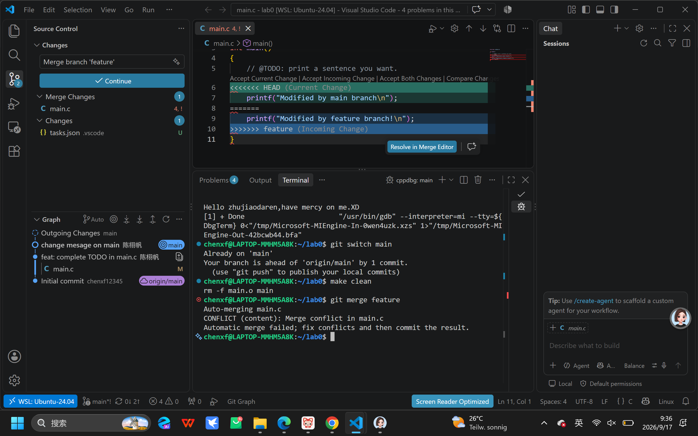
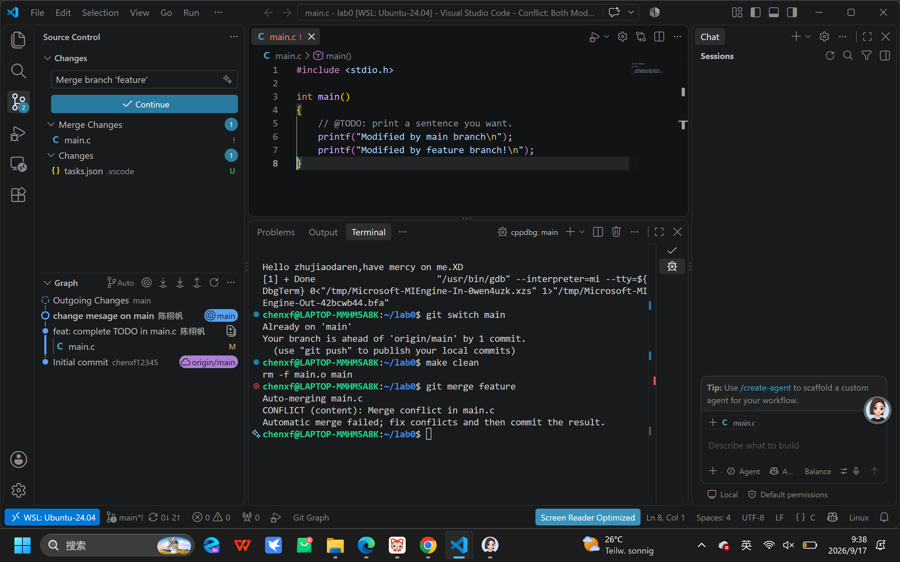

# 你之前有过多人协同开发的经历吗？如果有，你们是使用什么方式分工协作的？
    有。当时参加一个黑客松比赛。我和我的舍友一起完善一个番茄钟小项目。当时的分工协作方法非常质朴。我们拉了一个小群。初版文件做好后。如果谁要改动它提前在群里说一声。改好了发回群里。然后再把这一份文件交给下一个人改。基本上不存在两个人同时改一份文件的存在。只是接力。
# 思考一下，Git 为什么要设计“暂存-提交”两个步骤？
    1、如果一个人，同时修改了 多个不同的文件，而且改动方式不同，有的增加内容，有的改bug，没有暂存区，只能被迫把这几种完全不相关的改动打包成一次提交。有了暂存区，可以利用 git add 保证每一次 commit 只做一件独立的事情，逻辑清晰。
    2、 正如同lab里说的，vector 和 unordered_map 可能在不同情况下都要发挥作用，Git 的 commit 历史非常重要，就跟一个功能的不同笔记一样。在正式commit前，把文件放进暂存区，可以仔细检查。不会加入垃圾代码污染记录。
    3、而且当多人编辑的时候，合并分支产生冲突时，可以在在暂存区跳出修改好的代码。
# git branch 和 git branch -a 的区别是什么？查阅资料并回答。
   经过查阅Git 官方手册页和 Pro Git
    git branch是默认的，仅列出Local Branches。
    也就是输出时，在本地仓库中创建和检出的分支，当前所在的分支名称前会带有一个星号 。它完全不会显示GitHub、GitLab等上存在但本地未检出的分支。
    git branch -a是全量展示，-a 是 --all 的简写。作用范围：列出本地分支以及所有Remote Tracking Branches。输出除了包含上述的本地分支外，还会以红色字体或以 remotes/<remote-name>/<branch-name>（例如 remotes/origin/main、remotes/origin/feature）的形式，把本地记录的远程仓库的所有分支全部罗列出来。
    假设一个项目本地只有一个 main 分支，但 GitHub 上还有其他人创建的 dev 和 fix-bug 分支：
    运行 git branch 输出：
* main
     运行 git branch -a 输出：
* main
  remotes/origin/HEAD -> origin/main
  remotes/origin/main
  remotes/origin/dev
  remotes/origin/fix-bug
#概括两篇文章的内容：
  #1、commit message的规范。
Type（开头）：
·  feat：新功能（feature）。
·  fix：修补Bug。
·  docs：仅文档改动（documentation）。
·  style：代码格式变动（空格、分号等）。
·  refactor：重构（既不加新功能，也不修 Bug 的代码优化）。
·  test：增加或修改测试用例。
·  chore：构建流程、依赖包或辅助工具的改动。
·  scope（影响范围，选填）：说明这次修改波及了哪个模块（例如 feat(login): ... 或 fix(parser): ...）。
·   subject（简短描述，必填）：不超过 50 个字符。原则是动词开头、首字母小写、结尾不加句号。
  2. Body（详细说明，选填）
多行详细解释代码变动的动机，以及与之前行为的对比。
  3. Footer（特殊标记）
仅在两种场景下使用：
 破坏性变更：代码改动导致与上一个版本不向下兼容（例如重构了公共接口），必须在 Footer 详细说明迁移指南。
  关联并关闭 Issue
  4 配套的自动化工程工具：
Commitizen：将平时的 git commit 改为 git cz，终端会弹出一套问卷，引导你选类别、写描述，自动拼装成标准格式。
利用Git Hook。写不合规的内容，脚本会直接报错并拒绝提交。
conventional-changelog软件准备发布新版本时，执行一行命令，工具会自动把所有带 feat、fix 和 BREAKING CHANGE 的提交提炼整理成一份排版优雅的 CHANGELOG.md 文档。
   #核心架构：Gitflow  5 大分支
1. 长期常驻分支
master（生产分支）：永远与线上实际运行的代码完全一致，追求最高的绝对稳定性。任何人都不允许直接在 master 上敲代码。只有经过完整测试准备发版时，才能合并进来，且每次合并后必须打 Tag（如 1.0.0）作为版本归档。
develop（日常开发分支）：所有最新开发成果的汇聚中心。它是团队成员协作的“公共大厅”，从 master 分离出来，但日常开发同样不建议直接在上面写，而是作为 feature 分支的汇合地。
2. 辅助/临时分支（任务完成即删除，即用即销）
feature（新功能分支）:从 develop 拉出，开发自测完毕后合并回 develop，然后立刻删除。
一个需求或功能点对应一个分支，保证各开发人员之间代码完全隔离，互不干扰。
release（预发布/提测分支）：当一轮迭代的所有 feature 都在 develop 搞定后，从 develop 切出供测试团队验证。在这个分支上只修测试出来的 Bug，不再塞任何新功能。测试彻底通过后，同时合并到 master（准备上线）和 develop（同步 bugfix），然后删除。
hotfix（线上紧急修复分支）：直接从生产环境的 master（或对应故障的 Tag）拉出，修完后同时合并回 master 和 develop，然后删除。无需等待正在进行中的常规需求迭代。
“从哪里来，最后回到哪里去”
强调使用 --no-ff（禁用快进合并）合并时要用 git merge --no-ff。
默认的 fast-forward 合并会抹平分支历史；而 --no-ff 会强制生成一个“合并提交（Merge Commit）”，清晰地保留这个功能分支曾经存在过的历史图谱，利于日后排查责任和回退。
语义对齐的版本号与 Tag：采用类似 X.Y.Z 结构（主版本.次版本.修订号），每次合入 master 立即打 Tag，使得每一次线上发布都有迹可循。
# 谈谈你对“为什么要学习 Git”这个问题的理解
以前没用 Git 的时候，改代码总怕改坏了找不回来，只能隔几天复制一份，重命名成“项目_初版”、“项目_修改版”、“项目_最终版”、“项目_真的不改了版”。不仅占地方，时间一长自己都分不清哪个文件改了哪一行。用 Git 之后，点一下提交，它就自动记下当时的状态，写崩了随时能退回上一版，桌面再也不会堆满乱七八糟的备份文件夹。
几个人做同一个大作业，如果靠微信或者 U 盘互相传代码，你改了你的，我改了我的，最后合到一起极其痛苦，甚至一不小心就把别人的代码覆盖掉了。学会了 Git，大家各自在自己的分支上写，最后合并。哪怕改了同一个地方，Git 也会把冲突标出来，两个人坐在一起商量留哪一句就行，省去了大量手动对代码的麻烦。
只要去软件公司实习或者找工作，团队开发必然要用 Git。每天上班从仓库拉取最新代码，写完提交上去，别人帮你检查。
#截图证明
简要步骤：
使用实验模板建仓并克隆至本地，完成 main.c 中的 TODO 并在 main 分支进行了初次提交；
新建并切换至 feature 分支，修改第 6 行打印语句并提交；
切回 main 分支，在相同行做了不同的修改并提交，构造出分叉历史；
运行 git merge feature 成功触发合并冲突；
手动排解冲突，保留所需内容，通过 VS Code 界面点击 Continue 完成了合并提交。
### 冲突现场截图

### 解决冲突后的截图
